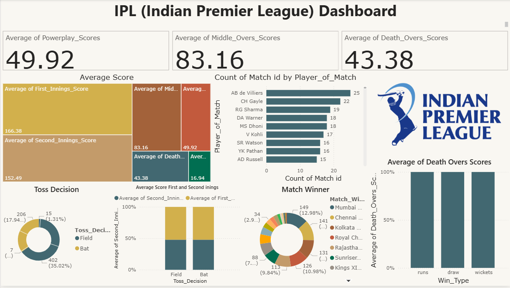

# 🏏 IPL Exploratory Data Analysis (2008–2025)

  
  
  
  
  

---

## 📊 Dashboard Preview

---

## 📌 Project Overview
This project explores the **Indian Premier League (IPL)** dataset (2008–2025) to uncover patterns in:

- 🏆 **Team performance**  
- ⭐ **Player contributions**  
- 🎲 **Toss decisions**  
- 🏟️ **Venue influence**  
- 📈 **Scoring trends**

Using **Python (Pandas, Matplotlib, Seaborn)**, we analyze IPL history to reveal **hidden insights and storytelling through data**.

---

## 📂 Dataset Features
The dataset includes:

- 📅 **Date of match**  
- 🏟️ **Venue**  
- 🏏 **Teams**  
- 🎲 **Toss Winner & Decision**  
- 🏆 **Match Winner**  
- 🔢 **Win Type & Win Margin**  
- ⭐ **Player of the Match**  
- 📊 **Innings & Phase Scores** (Powerplay, Middle Overs, Death Overs)  

---

## 🔍 EDA Process

### 🛠️ Data Cleaning & Preparation
- Handled **missing values**  
- Extracted **Year & Season**  
- Standardized **team names**

### 📊 Univariate Analysis
- Wins per team  
- MVPs (Player of the Match)  
- Toss outcomes  
- Score distributions

### 🔗 Bivariate Analysis
- Toss decision vs Match result  
- Venue vs Win type  
- Team performance by season

### 🗺️ Correlation & Heatmaps
- Scoring phase contributions  
- First innings vs Second innings scores

---

## 📈 Key Insights

### 🏆 Team Performance
- **Mumbai Indians (MI):** 149 wins in 274 matches → Most successful franchise  
- **Chennai Super Kings (CSK):** 141 wins in 249 matches → Highly consistent  
- **New Teams:** Gujarat Titans show **impressive win %**  
- **Draws/No Results:** 19 matches across all seasons  

📊 Example:  

---

### ⭐ Player Impact
- **AB de Villiers** leads **Player of the Match awards**, followed by **Chris Gayle**.  
- Consistent match-winners shaped their teams’ legacies.  

📊 Example:  

---

### 🎲 Toss & Match Outcomes
- Toss winners win **51%** of games → small advantage  
- **Chasing teams win 53%**, reflecting modern T20 strategy  

📊 Example:  

---

### 📈 Scoring Patterns
- **Average 1st innings score:** ~166  
- **Powerplay Avg:** ~50 (30–60 common)  
- **Death Overs:** highest variability (40–60 runs peak)  
- Strong **Powerplay starts (>50)** often → victories  

📊 Example:  

---

### 🏟️ Venue Influence
- **M. Chinnaswamy & Wankhede** host most matches  
- Some venues favor **chasing teams**, others defending totals  

📊 Example:  

---

### 🧩 Correlation Heatmap
- Strong correlation:  
  - **First Innings vs Second Innings Score (0.67)**  
  - **Powerplay/Middle/Death overs → Total Score**  
- Negative correlation:  
  - **Win Margin vs Second Innings Score (-0.32)**  

📊 Example:  

---

## 🎯 Conclusions
- 🏆 **Mumbai Indians & CSK** remain most consistent  
- 🎲 Toss does **not guarantee victory** → skill dominates  
- 📈 **Chasing strategy** defines modern IPL  
- 🚀 **Powerplay performance** drives outcomes  
- 🔥 IPL = **Data, Drama & Dominance**  

---

## 🛠️ Tech Stack
| Tool | Purpose |
|------|----------|
| 🐍 Python | Programming |
| 🧮 Pandas, NumPy | Data Wrangling |
| 📊 Matplotlib, Seaborn | Visualization |
| 📘 Jupyter Notebook / Google Colab | Analysis Environment |
| 🧠 Power BI, Tableau | Dashboards & Reporting |

---

## 🚀 Future Scope
- 🧠 Build a **Win Predictor ML Model**  
- 📈 Expand to **Auction & Salary Analysis**  
- 🌐 Create interactive dashboards  

---

## 👨‍💻 Author
**Bheemankar Vijay**  
📅 *Project Year:* 2025  
🔗 [GitHub Profile](https://github.com/BheemankarVijay)

---

⭐ *If you found this project insightful, don’t forget to star the repo!*
