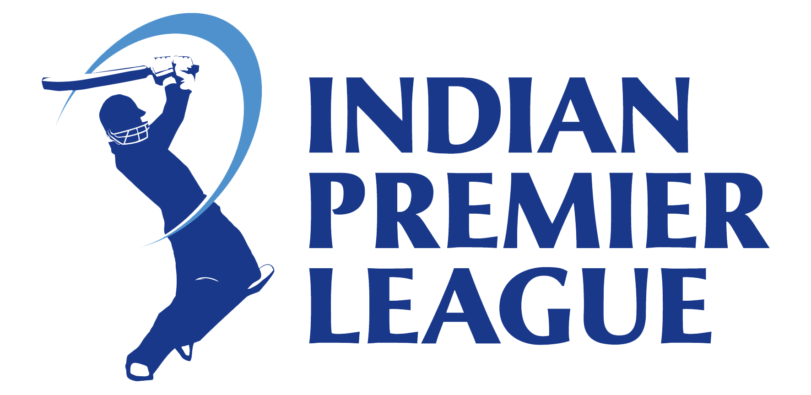
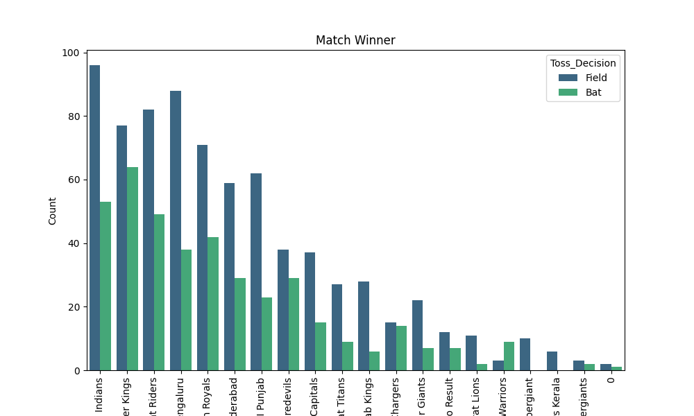
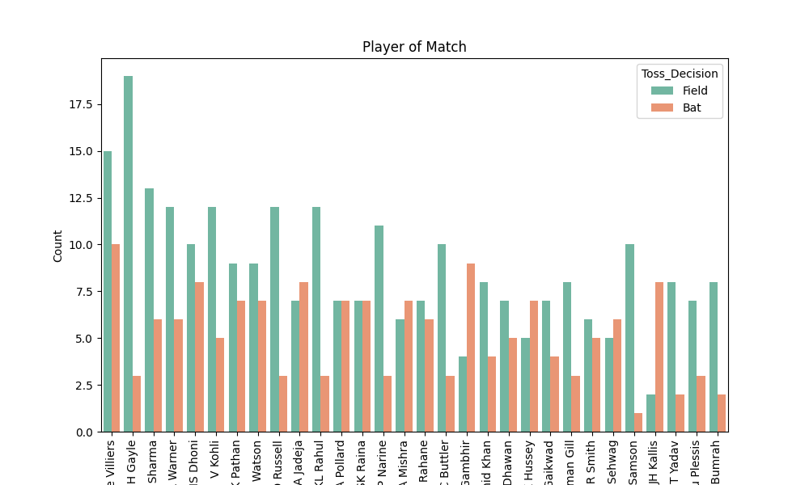
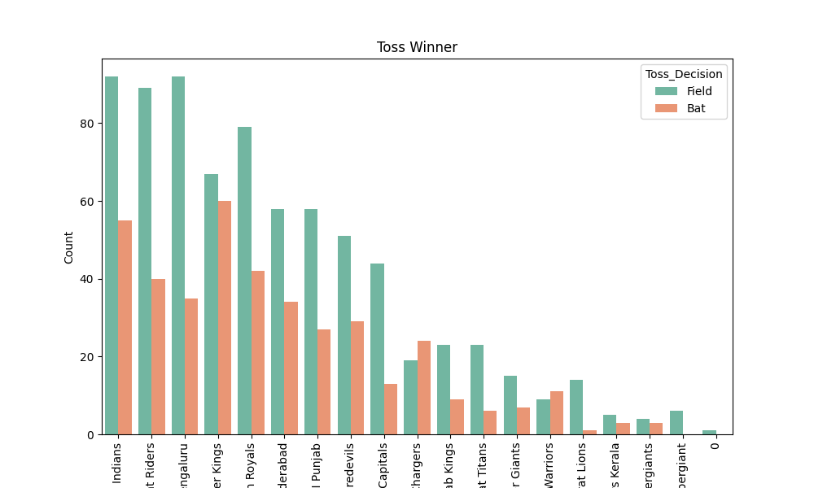
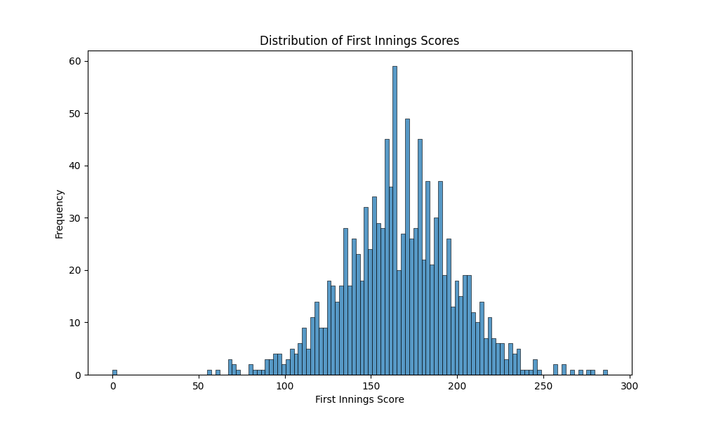
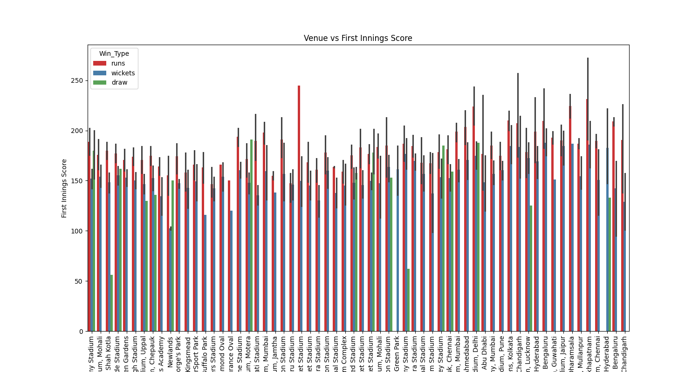
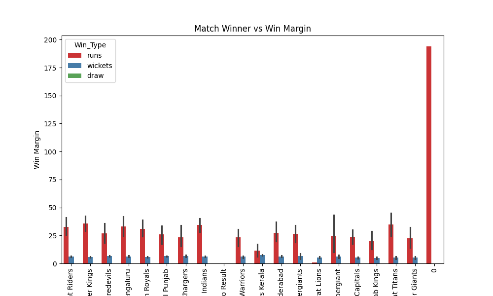
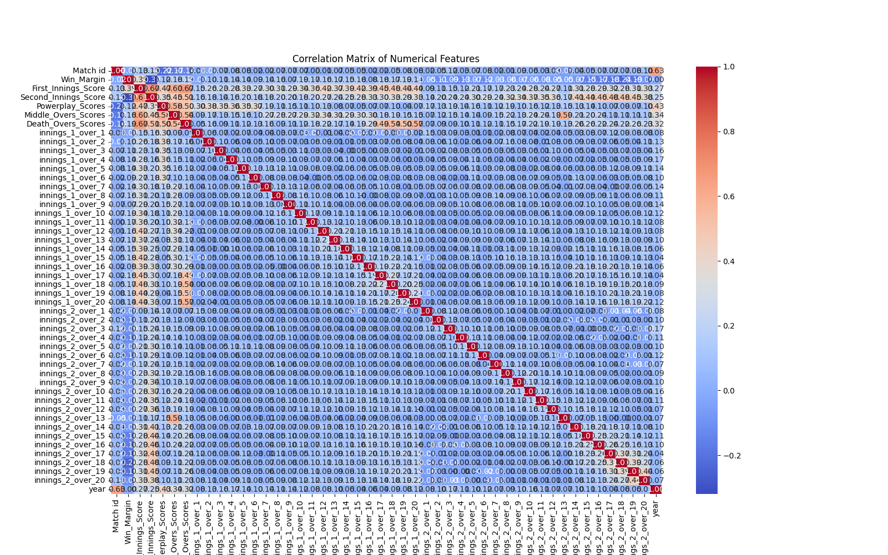

# 🏏 IPL Exploratory Data Analysis (2008–2025)

 

---

## 📌 Project Overview
This project explores the **Indian Premier League (IPL)** dataset from **2008–2025** to uncover patterns in:

- 🏆 **Team performance**  
- ⭐ **Player contributions**  
- 🎲 **Toss decisions**  
- 🏟️ **Venue influence**  
- 📈 **Scoring trends**

Using **Python (Pandas, Matplotlib, Seaborn)**, we analyze IPL history to reveal **hidden insights and storytelling through data**.

---

## 📂 Dataset Features
The dataset includes:

- 📅 **Date of match**  
- 🏟️ **Venue**  
- 🏏 **Teams**  
- 🎲 **Toss Winner & Decision**  
- 🏆 **Match Winner**  
- 🔢 **Win Type & Win Margin**  
- ⭐ **Player of the Match**  
- 📊 **Innings & Phase Scores** (Powerplay, Middle Overs, Death Overs)  

---

## 🔍 EDA Process
### 🛠️ Data Cleaning & Preparation
- Handled **missing values**  
- Extracted **Year & Season**  
- Standardized **team names**  

### 📊 Univariate Analysis
- Wins per team  
- MVPs (Player of the Match)  
- Toss outcomes  
- Score distributions  

### 🔗 Bivariate Analysis
- Toss decision vs Match result  
- Venue vs Win type  
- Team performance by season  

### 🗺️ Correlation & Heatmaps
- Scoring phase contributions  
- First innings vs Second innings scores  

---

## 📊 Key Insights

### 🏏 Team Performance
- **Mumbai Indians (MI):** 149 wins in 274 matches → Most successful franchise.  
- **Chennai Super Kings (CSK):** 141 wins in 249 matches → Highly consistent.  
- **New Teams:** Rising Pune Supergiant & Gujarat Titans show **impressive win %**.  
- **Draws/No Results:** 19 matches across all seasons.  

📌 Example Plot:  

---

### ⭐ Player Impact
- **AB de Villiers** leads **Player of the Match awards**, followed by **Chris Gayle**.  
- Consistent match-winners shaped their teams’ legacies.  

📌 Example Plot:  

---

### 🎲 Toss & Match Outcomes
- Toss winners win **51%** of games → **small advantage**.  
- **Chasing teams win 53%**, reflecting modern **T20 strategy**.  

📌 Example Plot:  

---

### 📈 Scoring Patterns
- **Average 1st innings score:** ~166  
- **Powerplay Avg:** ~50 (30–60 common)  
- **Death Overs:** highest variability (40–60 runs peak)  
- Strong **Powerplay starts (>50)** often → victories  

📌 Example Plot:  

---

### 🏟️ Venue Influence
- **M. Chinnaswamy & Wankhede** host most matches.  
- Some venues favor **chasing teams**, others defending totals.  

📌 Example Plot:  

---

### 📊 Win Margins
- Most IPL matches are **close contests**.  
- Wins by **runs** usually have **higher margins** than wins by **wickets**.  

📌 Example Plot:  

---

### 🔗 Correlation Heatmap
- Strong correlation:  
  - **First Innings vs Second Innings Score (0.67)**  
  - **Powerplay/Middle/Death overs → Total Score**  
- Negative correlation:  
  - **Win Margin vs Second Innings Score (-0.32)**  

📌 Example Plot:  

---

## 🎯 Conclusions
- 🏆 **Mumbai Indians & CSK** are the most consistent franchises.  
- 🎲 Toss does **not guarantee a win** → skill matters more.  
- 📈 **Chasing strategy dominates** modern IPL.  
- 🚀 **Powerplay performance** is crucial in setting match direction.  
- 🔥 IPL remains highly competitive, with **thrilling close finishes**.  

---

## 🛠️ Tech Stack
- **Python 🐍**  
- **Pandas, NumPy** – Data Wrangling  
- **Matplotlib, Seaborn** – Visualization  
- **Jupyter Notebook**  

---

## 📌 Future Scope
- 🏏 Build a **Win Predictor Model** using ML.  
- 📊 Create **Power BI / Tableau Dashboards**.  
- 💰 Extend analysis to **player auctions & salaries**.  

✨ With data, the **IPL becomes more than entertainment** — it’s a story of **numbers, strategy, and legacy**.  

---

## 👨‍💻 Author
- **Your Name Here**  
- 📅 Project Year: 2025  
- 🔗 [GitHub Profile](https://github.com/BheemankarVijay)  

---
