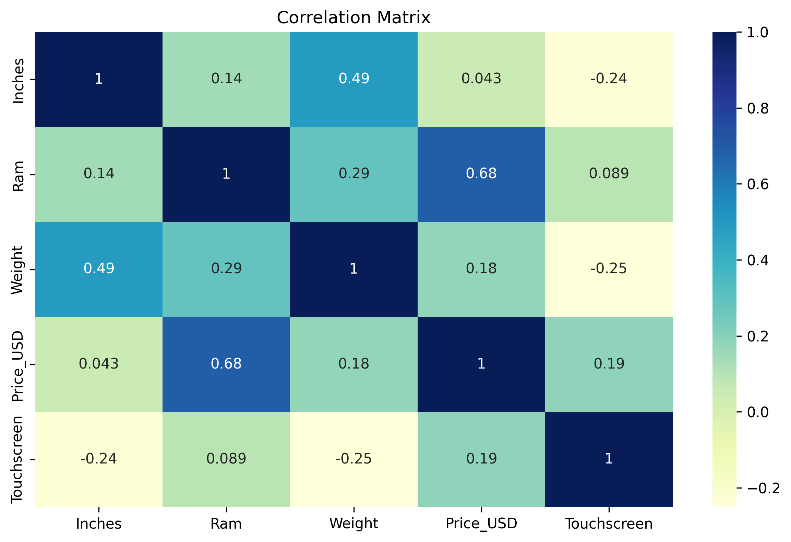

# 💻 Laptop Price EDA Project

This project performs an **Exploratory Data Analysis (EDA)** on a dataset containing various specifications of laptops and their prices. The aim is to uncover patterns, relationships, and key insights that influence laptop pricing.

---

## 📂 Project Structure

---

## 📌 Sections Covered

- **1. Introduction**
- **2. Data Importing**
- **3. Data Cleaning**
- **4. Univariate Analysis**
- **5. Bivariate Analysis**
- **6. Feature Engineering**
- **7. Correlation Heatmap**
- **8. Key Insights & Summary**
- **9. Conclusion**
- *(Optional)* Save cleaned data or plots

---

## 📊 Dataset Description

The dataset includes the following columns:
- Company
- TypeName
- Inches
- ScreenResolution
- Cpu
- Ram
- Memory (HDD/SSD)
- Gpu
- OpSys
- Weight
- Price

---

## 🔍 Key Insights

### 🔥 Correlation Heatmap

### 💻 Operating System Distribution

- **Windows 10** dominates the market share among Operating Systems.
- **SSD-equipped** laptops and **i7 CPUs** strongly increase laptop prices.
- **Apple**, **Dell**, and **Workstation** laptops are typically in the premium price range.
- **Touchscreen laptops** are generally lighter and have smaller screens.
- **Weight** increases with screen size and RAM.
- Strong positive correlation between **Inches and Weight** (0.49).

---

## 🛠 Tools Used

- [x] Python
- [x] Google Colab
- [x] Pandas
- [x] NumPy
- [x] Seaborn
- [x] Matplotlib

---

## 🚀 How to Run

1. Open the `.ipynb` file using **Google Colab** or **Jupyter Notebook**.
2. Run cells step by step to follow the EDA process.
3. All plots are generated inline and insights are printed within the notebook.

---

## ✅ Final Thoughts

This EDA revealed how laptop specifications — especially **RAM**, **SSD presence**, **brand**, and **CPU type** — significantly impact pricing. It also demonstrated how screen size, weight, and operating systems play roles in user preferences and pricing tiers.

---

