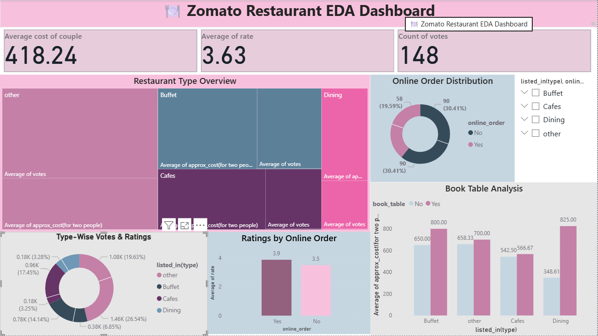

<h1 align="center">🍽️ Zomato Restaurant EDA & Dashboard</h1>

  
  
  
  
  

  

  <b>Exploratory Data Analysis (EDA) of Zomato Restaurant Data using Python, Pandas, Matplotlib, and Seaborn</b> 
  <i>Analyzing restaurant trends, pricing, ratings, and customer behavior.</i>

---

## 🧠 Project Overview
This project explores the **Zomato Restaurant dataset** to uncover insights about customer preferences, restaurant popularity, pricing, and service patterns.  
Through **EDA and visualization**, we identify how factors like online ordering, table booking, and pricing affect customer ratings.

---

## 📂 Dataset Information

| Column | Description |
|:-------|:-------------|
| `name` | Restaurant name |
| `online_order` | Whether online ordering is available (Yes/No) |
| `book_table` | Whether table booking is available (Yes/No) |
| `rate` | Customer rating (cleaned from “4.1/5” → 4.1) |
| `votes` | Number of customer votes |
| `approx_cost(for two people)` | Approximate cost for two people (cleaned to numeric) |
| `listed_in(type)` | Restaurant category (Delivery, Buffet, Drinks & Nightlife, etc.) |

---

## 🧹 Data Cleaning Steps
✔️ Handled missing values in `rate` and `approx_cost`  
✔️ Cleaned `rate` column (removed “NEW”, “-”, etc.)  
✔️ Converted `approx_cost(for two people)` to numeric  
✔️ Renamed columns for simplicity  
✔️ Removed duplicates  

---

## 📊 Exploratory Data Analysis (EDA)

### 🔸 **Univariate Analysis**
- Distribution of restaurant types (`listed_in(type)`)
- Count of restaurants offering **online ordering** and **table booking**
- Distribution of **ratings** and **votes**

### 🔹 **Bivariate Analysis**
- Impact of **online ordering** on ratings  
- Relationship between **votes** and **ratings**  
- **Average cost vs rating** trend  
- Effect of **table booking** on ratings  

### 🧩 **Feature Engineering**
- Created `price_category` → **Low / Medium / High** based on `approx_cost`

---

## 🎨 Visualizations Used
📊 Countplot  
📈 Barplot  
📦 Boxplot  
🎻 Violinplot  
📉 Scatterplot  
🥧 Pie Chart  
📊 Histogram  

---

## 💡 Key Insights

✨ Restaurants with **online orders** and **table booking** show **higher ratings**  
💰 **Premium (High cost)** restaurants tend to have higher ratings but not always more votes  
🚗 **Delivery-based** restaurants dominate over fine dining/nightlife venues  
⭐ **Customer votes** correlate positively with **ratings**, though some outliers exist  

---

## 🛠️ Tech Stack

| Tool | Purpose |
|:----|:---------|
| 🐍 Python | Programming & analysis |
| 🧮 Pandas | Data manipulation |
| 📊 Matplotlib | Visualization |
| 🎨 Seaborn | Advanced plotting |
| 🔢 NumPy | Numerical operations |
|🟡 Power BI | Business Intelligence |
---

## ✅ Conclusion

This project provided **hands-on experience** in:
- Data cleaning & preprocessing  
- Feature engineering  
- Visualization with Seaborn & Matplotlib  
- Drawing actionable business insights  

The analysis highlights how **service features, price, and customer engagement** influence restaurant ratings on Zomato.

---

## 🗂️ Project Structure
Zomato-Dashboard/
│
├── Zomato_EDA.ipynb
├── Dashboard.png
├── README.md
└── data/
└── zomato.csv

---

## 🌟 Dashboard Summary

The interactive **dashboard** visualizes:
- 🍴 Restaurant types & popularity  
- 📦 Online order and table booking trends  
- 💰 Cost distribution across categories  
- ⭐ Rating and vote relationships  

It gives a clear overview of **how customer preferences shape restaurant success**.

---

  <b>⭐ If you found this project useful, consider giving it a star on GitHub!</b>

---

  Made with ❤️ by <b>[Bheemankar Vijay]</b> | 📊 Data Analytics Project

